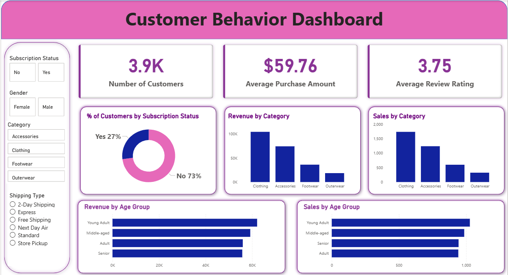

<h1 align="center">🛍️ Customer Shopping Behavior Analysis</h1>

<p align="center">
  End-to-end analytics project: data cleaning, SQL analysis, dashboarding, and business recommendations.
</p>

<p align="center">
  
  
  
  
</p>

<p align="center">
  <a href="./customer_behavior_dashboard.pbix">📊 Dashboard</a> ·
  <a href="./Customer_Shopping_Behavior_Analysis.pdf">📄 Full Report</a> ·
  <a href="./Customer-Shopping-Behavior-Analysis.pptx">🖥️ Presentation</a> ·
  <a href="./Customer_Shopping_Behavior_Analysis_.ipynb">🐍 Notebook</a> ·
  <a href="./customer_behavior_sql_queries.sql">🗄️ SQL Queries</a>
</p>

---

### At a Glance

| Customers analyzed | Total revenue | Revenue-driving segment | Loyal customer share |
|:---:|:---:|:---:|:---:|
| **10326** | **$233,081** | Male ($157.9K vs $75.2K female) | **80%** |

---

## 📋 Table of Contents

- [Executive Summary](#-executive-summary)
- [Project Overview](#-project-overview)
- [Dataset](#-dataset)
- [Business Questions](#-business-questions)
- [Data Preparation](#-data-preparation-python)
- [Statistical Analysis](#-statistical-analysis)
- [Business KPIs](#-business-kpis)
- [Customer Segmentation](#-customer-segmentation)
- [Key Findings](#-key-findings-sql)
- [Dashboard](#-dashboard-power-bi)
- [Business Recommendations](#-business-recommendations)
- [Conclusion](#-conclusion)
- [Repository Structure](#-repository-structure)
- [Running It Locally](#-running-it-locally)
- [Skills Demonstrated](#-skills-demonstrated)
- [Future Improvements](#-future-improvements)

---

## 📝 Executive Summary

**Business problem:** a retail business wants to understand customer purchasing behavior to improve marketing, retention, and revenue decisions.

**Objectives:** analyze customer demographics and spending patterns, identify high-value customer segments, evaluate the impact of subscription status on spending, examine product and category preferences, and turn the findings into business recommendations.

**Tools used:** Python (pandas, seaborn, matplotlib), PostgreSQL, SQL, Power BI.

**Outcome:** the analysis shows where revenue actually comes from (gender, age group, and spend segment), where retention is working, and where the discount strategy may be cutting into margin more than it needs to.

---

## 🔎 Project Overview

This project analyzes 3,900 customer shopping transactions to uncover patterns in spending, product preferences, and subscription behavior, then translates those patterns into concrete business recommendations. It follows the same workflow a retail analytics team would use end to end.

<p align="center">
  
</p>

| Stage | Tool |
|---|---|
| Data cleaning, feature engineering, EDA | Python (pandas) |
| Business question answering | SQL (PostgreSQL) |
| Interactive dashboard | Power BI |
| Report and stakeholder presentation | PDF and slides |

---

## 🗂 Dataset

- **10326 rows × 18 columns** of retail transaction data
- Customer demographics: age, gender, location, subscription status
- Purchase details: item, category, amount, season, size, color
- Behavior signals: discount usage, previous purchases, purchase frequency, review rating, shipping type
- **37 missing values** in `Review Rating`, imputed with the median rating per product category

---

## ❓ Business Questions

This analysis was scoped to answer:

- Which gender contributes the most revenue?
- Do customers who use discounts still spend above average?
- Which products are rated highest by customers?
- Does shipping type affect purchase amount?
- Does subscription status affect spending or revenue share?
- Which products rely most heavily on discounts to sell?
- How do customers break down by loyalty segment (New / Returning / Loyal)?
- What are the top-selling products within each category?
- Are repeat buyers more likely to subscribe?
- Which age group drives the most revenue?

---

## 🧹 Data Preparation (Python)

- Loaded and inspected the raw CSV with `pandas`
- Imputed missing `Review Rating` values using per-category medians
- Standardized column names to snake_case
- Engineered `age_group` (quartile-based bins) and `purchase_frequency_days` (mapped from purchase frequency labels)
- Verified `discount_applied` and `promo_code_used` were redundant and dropped the latter
- Loaded the cleaned dataset into PostgreSQL for SQL analysis

---

## 📐 Statistical Analysis

Additional checks run in the notebook beyond the core cleaning steps:

| Check | Result |
|---|---|
| Correlation (age, purchase amount, rating, previous purchases) | All pairwise correlations within ±0.05, so there's no meaningful relationship between these fields |
| Outlier detection (purchase amount, IQR method) | Upper fence is about $144, and zero values exceed it. Spending is bounded ($20 to $100), not long-tailed |
| Distribution shape (purchase amount) | Skewness is about 0.01, essentially symmetric, not the typical right-skewed retail spend pattern |

---

## 📌 Business KPIs

| Metric | Value |
|---|---|
| Total Revenue | **$233,081** |
| Average Order Value | **$59.76** |
| Customers | **3,900** |
| Average Review Rating | **3.75** |
| Subscriber Share | **27.0%** |

---

## 🎯 Customer Segmentation

Customers were split into four equal-sized groups (Low, Medium, High, Premium) by purchase amount quartile.

| Segment | Revenue | Share of Total Revenue |
|---|---|---|
| Premium | $84,350 | **36.2%** |
| High | $70,197 | 30.1% |
| Medium | $48,602 | 20.9% |
| Low | $29,932 | 12.8% |

Each segment holds the same number of customers, but revenue splits unevenly. Premium customers generate close to 3 times the revenue of Low spenders despite being the same size group, which makes them a concrete target for loyalty or retention offers.

---

## 📈 Key Findings (SQL)

Ten business questions were answered directly against the cleaned dataset. Full queries are in [`customer_behavior_sql_queries.sql`](./customer_behavior_sql_queries.sql).

| # | Question | Finding |
|---|---|---|
| 1 | Revenue by gender | Male customers generate **$157,890** vs. **$75,191** for female customers, roughly double |
| 2 | High-spending discount users | **839 customers** used a discount and still spent above the average purchase amount |
| 3 | Top 5 rated products | Gloves (3.86), Sandals (3.84), Boots (3.82), Hat (3.80), Skirt (3.78) |
| 4 | Standard vs. Express shipping | Express customers spend slightly more on average (**$60.48 vs. $58.46**, about 3.5%) |
| 5 | Subscribers vs. non-subscribers | Non-subscribers spend marginally more on average ($59.87 vs. $59.49); subscribers contribute **27%** of revenue |
| 6 | Most discount-dependent products | Hat (50% of purchases discounted), Sneakers (49.7%), Coat (49.1%), Sweater (48.2%), Pants (47.4%) |
| 7 | Customer segmentation | Loyal: **3,116** (80%), Returning: **701** (18%), New: **83** (2%) |
| 8 | Top 3 products per category | Accessories: Jewelry; Clothing: Blouse/Pants; Footwear: Sandals; Outerwear: Jacket |
| 9 | Repeat buyers (>5 purchases) and subscription | 958 subscribe, 2,518 don't, so there's no strong link between repeat buying and subscribing |
| 10 | Revenue by age group | Young Adult ($62,143) leads, followed by Middle-aged, Adult, and Senior in a fairly even spread |

---

## 📊 Dashboard (Power BI)

<p align="center">
  
</p>

Interactive filters for subscription status, gender, category, and shipping type. Open [`customer_behavior_dashboard.pbix`](./customer_behavior_dashboard.pbix) in Power BI Desktop to explore.

---

## 💡 Business Recommendations

- **Boost subscriptions.** Subscribers currently spend about the same as non-subscribers, so the program isn't yet driving extra spend. Exclusive perks could change that.
- **Convert New to Returning to Loyal.** Only 2% of customers are "New," suggesting strong retention once someone makes a second purchase. Worth investigating what drives that early conversion.
- **Rebalance discount strategy.** Several products (Hat, Sneakers, Coat) rely on discounts for roughly half their sales. Review the margin impact.
- **Lean into express shipping.** It correlates with modestly higher spend and could be promoted as an upsell.
- **Target Premium and Young Adult segments.** Premium spenders generate close to 3 times the revenue of Low spenders, and Young Adult is the highest revenue-contributing age group.

---

## ✅ Conclusion

This project analyzed 3,900 customer transactions using Python, SQL, PostgreSQL, and Power BI. The work covered cleaning and preparing the raw data, answering ten business questions in SQL, checking the numeric fields statistically, and grouping customers into spend-based segments.

The main findings: male customers generate roughly double the revenue of female customers, 80% of customers fall into the loyal segment, Premium spenders generate close to 3 times the revenue of Low spenders, and several products depend on discounts for around half their sales. These findings feed directly into the business recommendations above.

---

## 🗃 Repository Structure

```
├── Customer_Shopping_Behavior_Analysis_.ipynb   # Data cleaning, feature engineering, EDA
├── customer_behavior_sql_queries.sql            # 10 business questions in SQL
├── customer_behavior_dashboard.pbix             # Power BI interactive dashboard
├── Customer_Shopping_Behavior_Analysis.pdf       # Full written report
├── Customer-Shopping-Behavior-Analysis.pptx      # Stakeholder presentation
├── customer_shopping_behavior.csv                # Raw dataset
├── requirements.txt                              # Python dependencies
├── dashboard_preview.png                         # Dashboard image used in this README
└── workflow_diagram.png                          # Workflow image used in this README
```

## ⚙️ Running It Locally

```bash
pip install -r requirements.txt
```

Open the notebook and run cells top to bottom. The database connection cells expect a local PostgreSQL instance. Set credentials via environment variables rather than hardcoding them:

```python
import os
password = os.environ.get("DB_PASSWORD")
```

---

## 🧠 Skills Demonstrated

`Python` · `pandas` · `Data Cleaning` · `Feature Engineering` · `SQL` · `PostgreSQL` · `Power BI` · `Data Visualization` · `Customer Segmentation` · `Business Reporting`

---

## 🚀 Future Improvements

- Customer churn prediction model
- RFM (Recency, Frequency, Monetary) segmentation
- Interactive Streamlit dashboard as a lightweight alternative to Power BI
- Deploy the dashboard for public access
- Automate data refresh for real-time updates

---

## 📄 License

MIT, see [LICENSE.txt](./LICENSE.txt)

<p align="center">
  <b>Suvam Priyaranjan Sahoo</b><br>
  <a href="https://github.com/suvampriyaranjansahoo">GitHub</a>
</p>
